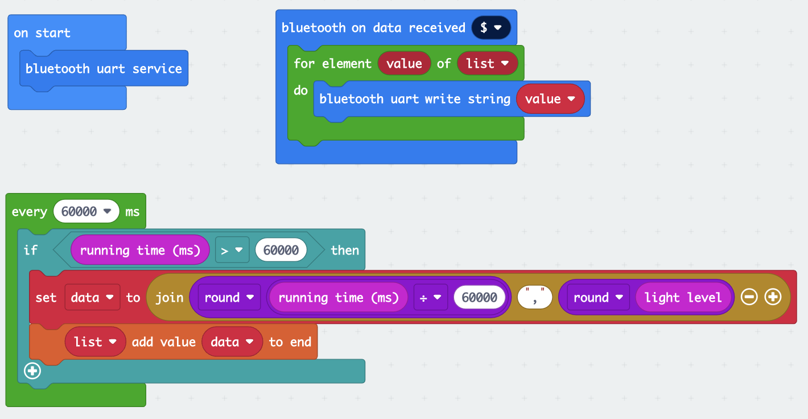

# zanilu-light-sensor-ble

Micro:bit coding lesson to demonstrate collecting light intensity data, then uploading the data via bluetooth.  
Uses [bluetooth Makecode extension](https://makecode.microbit.org/reference/bluetooth) and [micro:bit Web Bluetooth library](https://github.com/thegecko/microbit-web-bluetooth).

[Try me](https://TimBiernat.github.io/zanilu-light-sensor-ble)

